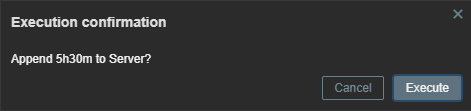

# Zabbix Manual Action Add Maintenance Time

This script is designed to manage maintenance periods for a specific host in Zabbix via the manual host action feature in Zabbix 7.0.  
It creates or updates a maintenance window for a given host, using a user-specified period (e.g. `1h30m`), and handles the following logic:

- If the user inputs a period > 0, the script either creates a new maintenance or updates an existing maintenance that matches the name pattern `Script Maintenance Host: <hostname>`.
- If the user inputs `0`, the script will remove an existing script-managed maintenance (if present).
- If no script-managed maintenance is found and the period is `0`, nothing is done.
- If the specified maintenance period is shorter than 600 seconds, it will be set to 600 seconds to comply with Zabbix's minimum period requirement.
- The maintenance is created or updated to apply to a single host only, ensuring existing maintenances for other hosts or other custom maintenances remain unaffected.
- The description field of the maintenance is set to show until what time the maintenance will last.

## Requirements

- Zabbix 7.0 or higher (due to the added feature to enter manual input).
- A valid Zabbix API token and URL (passed via `api_token` and `api_url`).
- A hostname (`hostname`) of an existing host in Zabbix.
- A period input string (`period`) that can be parsed and converted into seconds. Supported units: `y`, `M`, `d`, `h`, `m`, `s`.  
  Examples: `1h`, `3h30m`, `1d2h`, `0` (for removal).

## Installation

1. Navigate to **Alerts -> Scripts** in the Zabbix UI (Zabbix 7.0).
2. Create a new script with the following parameters:

   - **Name:** Add Maintenance Time  
   - **Scope:** Manual host action  
   - **Menu path:** Maintenance  
   - **Type:** Webhook

   **Parameters:**
   - `api_token = {$API_TOKEN}` (a global User Macro storing your Zabbix API Token)
   - `api_url = {$API_URL}` (a global User Macro storing your Zabbix API URL)
   - `hostname = {HOST.HOST}`
   - `period = {MANUALINPUT}`

   **Script:**  
   Paste the entire JavaScript code into the Script field.

   **Advanced configuration:**
   - Enable user input: **Enabled**
   - Input prompt: `Add Maintenance Duration for {HOST.NAME} (e.g. 1y2M3d4h5m6s or 0 to disable active Maintenance)`
   - Input type: String
   - Default input string: `3h`
   - Input validation rule: `(\d+y)?(\d+M)?(\d+d)?(\d+h)?(\d+m)?(\d+s)?`
   - Enable confirmation: **Enabled**
   - Confirmation text: `Append {MANUALINPUT} to {HOST.NAME}?`

3. Make sure your `{$API_TOKEN}` and `{$API_URL}` macros are correctly set up in Zabbix:
   - `{$API_URL}` should point to your Zabbix frontend’s API endpoint (e.g. `https://zabbix.example.com/api_jsonrpc.php`).
   - `{$API_TOKEN}` should be a valid API token created in Zabbix (Users -> API tokens).

4. Once saved, navigate to a host in the Zabbix UI, click on the dropdown menu in the top-right corner (Action menu), select the "Maintenance" path, and choose "Add Maintenance Time".  
   Provide a time period (e.g. `1h30m`), confirm, and the script will create or update the maintenance accordingly.

## How it Works

- The script takes the user input (`period`) and converts it to seconds.
- If `period > 0`, it checks if a matching script maintenance already exists:
  - If yes, it updates the existing maintenance with the new time.
  - If no, it creates a new maintenance named `Script Maintenance Host: <hostname>`.
- If `period = 0`, it tries to delete the existing script maintenance. If none found, it does nothing.
- If the requested period is less than 600 seconds (minimum required by Zabbix), it is automatically raised to 600 seconds.
- The script sets a description indicating until when the maintenance will be active.

## Example Usages

- Entering `2h` sets a 2-hour maintenance.
- Entering `10m` sets a 10-minute maintenance (if less than 600 seconds, it becomes 600 seconds).
- Entering `0` removes the existing script maintenance, if any.

## Troubleshooting

- Make sure you have correct values for `{$API_TOKEN}` and `{$API_URL}`.
- Ensure "EnableGlobalScripts" paramater in the Zabbix server config is enabled (1).
- Check the Zabbix server logs for script execution logs if something unexpected happens.
